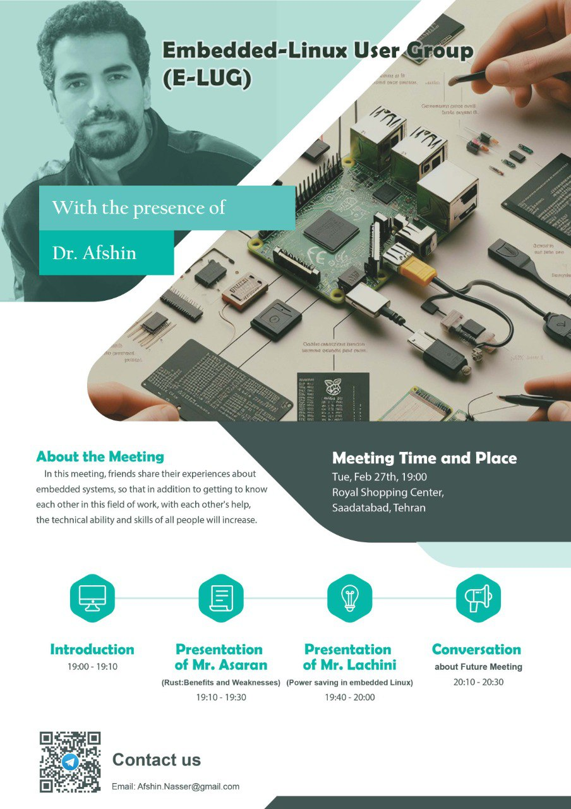

### E-LUG 1402

| Title  | Speaker | Slides | Video |
| ------------- | ------------- | ------------- | ------------- |
| Rust: Benefits and Weaknesses | [Hossein Assaran](https://github.com/HosseinAssaran) | PDF - PPTX | [Youtube](https://www.youtube.com/@E-LUG_IRAN) - Aparat |
| Power Saving in Embedded Linux | [Hossein Lachini](https://github.com/HosseinLachini) | [PDF](events/1402/12/PowerSaving14021208.pdf) - [ODP](events/1402/12/PowerSaving14021208.odp) | [Youtube](https://www.youtube.com/@E-LUG_IRAN) - Aparat |

