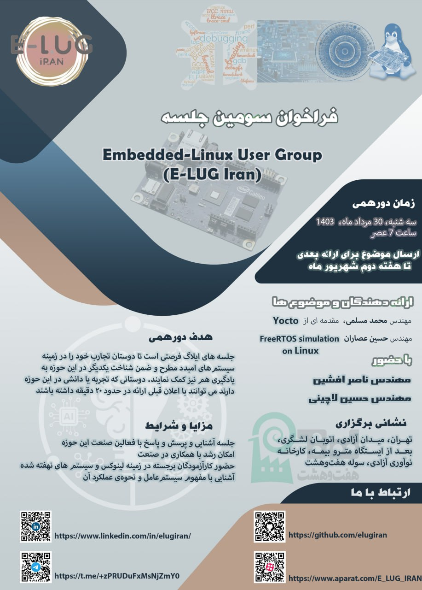

### E-LUG 1403

| Title  | Speaker | Slides | Video |
| ------------- | ------------- | ------------- | ------------- |
| Lessons From Android For Embedded Systems | [AbdoRahman Amani](https://github.com/adjexpress) | [PDF](events/1403/05/documents/LessonsFromAndroidForEmbeddedSystems.pdf) - [PPTX](events/1403/05/documents/LessonsFromAndroidForEmbeddedSystems.pptx) | [Youtube](https://www.youtube.com/@E-LUG_IRAN) - [Aparat](https://www.aparat.com/E_LUG_IRAN) |
| Rust in Embedded Systems (Avantages & Applications) | [M. Moslemi AbarGhan](https://www.linkedin.com/in/mohammad-moslemi-abarghan) | [PDF](events/1403/05/documents/RustinEmbeddedSystemsAvantagesApplications.pdf) - [PPTX](events/1403/05/documents/RustinEmbeddedSystemsAvantagesApplications.pptx) | [Youtube](https://www.youtube.com/@E-LUG_IRAN) - [Aparat](https://www.aparat.com/E_LUG_IRAN) |

